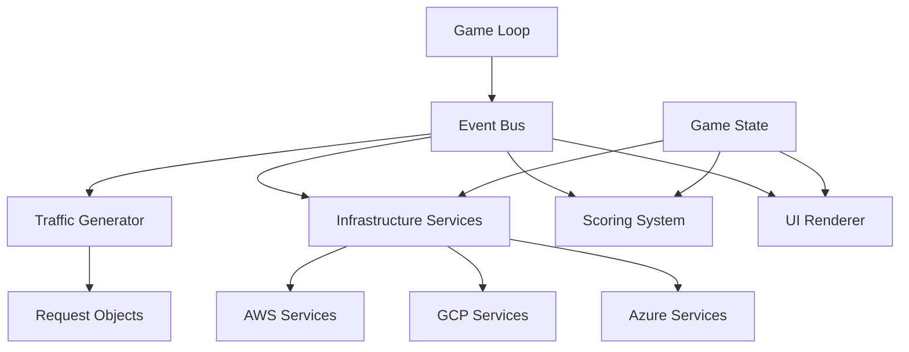

# CloudFall Game Design Document

## Overview

CloudFall is a browser-based infrastructure simulation game that teaches cloud architecture concepts through realistic gameplay. The game simulates AWS, GCP, and Azure services with authentic performance characteristics, pricing models, and trade-offs. Players build and manage cloud infrastructure to handle increasing traffic loads while balancing cost, availability, and reputation.

The simulation runs entirely client-side using modern JavaScript with a deterministic, event-driven architecture. Every game tick (1 second) processes traffic generation, request routing, service capacity logic, and metric updates to provide real-time feedback on architectural decisions.

## Architecture

### High-Level Architecture



### Core Components

**Game Engine**
- `Clock`: Manages 1-second tick intervals
- `EventBus`: Coordinates all component communication
- `GameLoop`: Orchestrates each simulation cycle
- `GameState`: Central state management with provider-specific sections

**Infrastructure Layer**
- Provider-specific service implementations (AWS, GCP, Azure)
- Base service interfaces for extensibility
- Service capacity and performance modeling
- Cross-provider communication penalties

**Traffic System**
- Request generation with realistic patterns
- Attack simulation and bot traffic
- Request routing through infrastructure
- Traffic visualization

**Scoring System**
- Real-time metrics calculation
- Provider-specific cost models
- Reputation and availability tracking
- Game over condition monitoring

## Components and Interfaces

### Base Service Interface

```javascript
class BaseService {
  constructor(name, provider, capacity, cost) {
    this.name = name;
    this.provider = provider; // 'aws', 'gcp', 'azure'
    this.capacity = capacity;
    this.baseCost = cost;
    this.currentLoad = 0;
    this.health = 'healthy'; // 'healthy', 'degraded', 'failed'
  }
  
  processRequests(requests) {
    // Override in provider-specific implementations
  }
  
  calculateLatency(load) {
    // Provider-specific latency curves
  }
  
  getCost() {
    // Provider-specific pricing models
  }
}
```

### Provider-Specific Services

**AWS Services**
- EC2: Burstable performance with credit system
- ALB: Advanced routing with health checks
- ElastiCache: Redis/Memcached with cluster mode
- RDS: Multi-AZ with read replicas
- SQS: Standard/FIFO queues with visibility timeout
- WAF: Rule-based filtering with managed rules

**GCP Services**
- Compute Engine: Sustained use discounts
- Cloud Load Balancing: Global anycast
- Memorystore: Redis with high availability
- Cloud SQL: Automatic storage scaling
- Pub/Sub: Global message ordering
- Cloud Armor: ML-powered DDoS protection

**Azure Services**
- Virtual Machines: Reserved instance pricing
- Application Gateway: Web application firewall
- Azure Cache: Enterprise-grade Redis
- Azure SQL: Serverless compute tiers
- Service Bus: Premium messaging
- Azure WAF: Threat intelligence integration

### Event System

```javascript
// Core events
const EVENTS = {
  TICK_START: 'tick_start',
  TRAFFIC_GENERATED: 'traffic_generated',
  REQUESTS_PROCESSED: 'requests_processed',
  METRICS_UPDATED: 'metrics_updated',
  SERVICE_DEPLOYED: 'service_deployed',
  PROVIDER_CHANGED: 'provider_changed'
};
```

## Data Models

### Request Model
```javascript
class Request {
  constructor(type = 'user', source = 'organic') {
    this.id = generateId();
    this.type = type; // 'user', 'bot', 'attack'
    this.source = source; // 'organic', 'campaign', 'ddos'
    this.timestamp = Date.now();
    this.path = '/';
    this.processed = false;
    this.dropped = false;
    this.latency = 0;
    this.provider = null; // Which provider processed this request
  }
}
```

### Service Model
```javascript
class ServiceInstance {
  constructor(serviceType, provider, config) {
    this.id = generateId();
    this.type = serviceType; // 'compute', 'loadbalancer', 'cache', etc.
    this.provider = provider;
    this.config = config;
    this.metrics = {
      requestsPerSecond: 0,
      averageLatency: 0,
      errorRate: 0,
      cost: 0
    };
    this.connections = []; // Connected services
  }
}
```

### Game State Model
```javascript
class GameState {
  constructor() {
    this.tick = 0;
    this.providers = {
      aws: { services: [], totalCost: 0 },
      gcp: { services: [], totalCost: 0 },
      azure: { services: [], totalCost: 0 }
    };
    this.metrics = {
      availability: 100,
      averageLatency: 0,
      totalCost: 0,
      reputation: 100,
      requestsProcessed: 0,
      requestsDropped: 0
    };
    this.scenario = null;
  }
}
```

## Correctness Properties

*A property is a characteristic or behavior that should hold true across all valid executions of a system-essentially, a formal statement about what the system should do. Properties serve as the bridge between human-readable specifications and machine-verifiable correctness guarantees.*

### Property Reflection

After reviewing all properties identified in the prework, several can be consolidated to eliminate redundancy:

**Consolidations:**
- Properties 3.1-3.5 (provider-specific service deployment) can be combined into a single comprehensive property about service differentiation
- Properties 4.1-4.3 (provider-specific characteristics) can be combined into one property about provider behavior differences
- Properties 5.1-5.5 (WAF variations) can be combined into one property about WAF service differentiation
- Properties 6.2-6.4 (provider-specific scaling) can be combined into one property about scaling behavior differences
- Properties 8.1-8.5 (UI rendering) can be combined into fewer comprehensive visualization properties

**Unique Properties Retained:**
- Deterministic behavior properties (1.1-1.3, 2.1-2.5)
- Multi-provider penalty/bonus properties (4.4-4.5)
- Service degradation properties (6.1, 6.5)
- Metrics and game over properties (7.1-7.4)
- Architecture pattern properties (9.1-9.4)
- Scenario behavior properties (10.2-10.3)

### Correctness Properties

Property 1: **Deterministic initialization**
*For any* initial game configuration, initializing the game multiple times should produce identical initial game states
**Validates: Requirements 1.1, 1.2**

Property 2: **Deterministic replay**
*For any* sequence of player actions, replaying the same actions should produce identical final game states and metrics
**Validates: Requirements 1.3**

Property 3: **Game tick consistency**
*For any* active game state, each game tick should execute traffic generation, request routing, service processing, metric updates, and UI rendering in the correct sequence
**Validates: Requirements 2.2**

Property 4: **Traffic composition**
*For any* traffic generation cycle, the generated traffic should contain legitimate users, bots, and attack requests in realistic proportions
**Validates: Requirements 2.3**

Property 5: **Request routing integrity**
*For any* infrastructure configuration and incoming requests, all requests should be routed through the configured infrastructure components without being lost or duplicated
**Validates: Requirements 2.4**

Property 6: **Provider service differentiation**
*For any* service type (Load Balancer, Compute, Cache, Database, Queue), each cloud provider (AWS, GCP, Azure) should offer distinct performance characteristics, pricing models, and capabilities
**Validates: Requirements 3.1, 3.2, 3.3, 3.4, 3.5**

Property 7: **Provider behavior consistency**
*For any* cloud provider selection, all services from that provider should consistently apply provider-specific pricing models, performance characteristics, and integration benefits
**Validates: Requirements 4.1, 4.2, 4.3**

Property 8: **Multi-provider penalties**
*For any* architecture using multiple cloud providers, cross-provider communication should incur additional latency and complexity costs compared to single-provider architectures
**Validates: Requirements 4.4**

Property 9: **Single-provider benefits**
*For any* architecture using a single cloud provider, services should receive integration bonuses and simplified networking compared to multi-provider architectures
**Validates: Requirements 4.5**

Property 10: **WAF service differentiation**
*For any* WAF deployment, each cloud provider should offer WAF services with distinct detection capabilities, blocking effectiveness, false positive rates, and costs
**Validates: Requirements 5.1, 5.2, 5.3, 5.4, 5.5**

Property 11: **Graceful service degradation**
*For any* service approaching capacity limits, performance should degrade gradually with increased latency before dropping requests, rather than failing abruptly
**Validates: Requirements 6.1**

Property 12: **Provider-specific scaling behavior**
*For any* service under increasing load, scaling behavior should follow provider-specific patterns (AWS auto-scaling, GCP optimization, Azure enterprise patterns)
**Validates: Requirements 6.2, 6.3, 6.4**

Property 13: **Over-provisioning cost penalties**
*For any* over-provisioned service, costs should increase according to provider-specific models to discourage resource waste
**Validates: Requirements 6.5**

Property 14: **Comprehensive metrics tracking**
*For any* running game, the system should continuously calculate and update availability percentage, average latency, cost per minute, reputation score, and provider-specific metrics
**Validates: Requirements 7.1**

Property 15: **Multi-provider cost tracking**
*For any* architecture using multiple providers, cross-provider communication costs and complexity penalties should be tracked and displayed separately
**Validates: Requirements 7.2**

Property 16: **Reputation-based game over**
*For any* game state where reputation reaches zero or below, the game should trigger game over conditions regardless of other metrics
**Validates: Requirements 7.3**

Property 17: **Availability-based game over**
*For any* game state where availability falls below SLA threshold for extended time, the game should trigger game over conditions with provider-specific SLA requirements
**Validates: Requirements 7.4**

Property 18: **Visual component representation**
*For any* infrastructure component, the visual representation should display provider-specific colors, icons, and health states (green/yellow/red) that accurately reflect the component's current status
**Validates: Requirements 8.1, 8.4**

Property 19: **Traffic flow visualization**
*For any* traffic flowing through the system, requests should be visualized as moving dots with colors indicating provider and request type
**Validates: Requirements 8.2**

Property 20: **Event bus communication**
*For any* component interaction, communication should occur exclusively through the Event Bus with appropriate provider-specific event types
**Validates: Requirements 9.1**

Property 21: **Stateless service design**
*For any* service implementation, the service should maintain minimal state and use provider-agnostic interfaces where possible
**Validates: Requirements 9.2**

Property 22: **Centralized state management**
*For any* game data, all simulation state should be maintained in the central Game State object with proper provider-specific organization
**Validates: Requirements 9.3**

Property 23: **Provider extensibility**
*For any* new cloud provider addition, the system should support the new provider through existing interfaces without breaking existing functionality
**Validates: Requirements 9.4**

Property 24: **Scenario traffic progression**
*For any* startup scenario execution, traffic volume and complexity should increase gradually over time, creating realistic scaling challenges
**Validates: Requirements 10.2**

Property 25: **Traffic spike challenges**
*For any* traffic spike event, the system should create performance and availability challenges that require appropriate scaling responses
**Validates: Requirements 10.3**

## Error Handling

### Service Failure Modes
- **Capacity Overload**: Services degrade performance before complete failure
- **Network Partitions**: Cross-provider communication failures
- **Configuration Errors**: Invalid service configurations
- **Resource Exhaustion**: Memory or connection limit breaches

### Error Recovery Strategies
- **Graceful Degradation**: Maintain partial functionality during failures
- **Circuit Breakers**: Prevent cascade failures between services
- **Retry Logic**: Automatic retry with exponential backoff
- **Fallback Mechanisms**: Alternative service paths during failures

### User Error Handling
- **Invalid Configurations**: Clear error messages for impossible setups
- **Budget Constraints**: Warnings when approaching cost limits
- **Performance Alerts**: Notifications when SLA thresholds are at risk

## Testing Strategy

### Dual Testing Approach

The CloudFall game requires both unit testing and property-based testing to ensure correctness:

**Unit Testing**
- Specific service behavior examples (AWS EC2 scaling, GCP load balancing)
- Edge cases (zero traffic, maximum capacity)
- Integration points between providers
- UI component rendering
- Game over condition triggers

**Property-Based Testing**
- Universal properties that hold across all providers and configurations
- Deterministic behavior verification
- Service capacity and performance characteristics
- Cost calculation accuracy across different scenarios
- Traffic routing integrity under various loads

### Property-Based Testing Framework

**Framework**: fast-check (JavaScript property-based testing library)
**Configuration**: Minimum 100 iterations per property test
**Tagging**: Each property-based test must include a comment with the format:
`**Feature: cloudfall-game, Property {number}: {property_text}**`

### Test Categories

**Determinism Tests**
- Verify identical outcomes for identical inputs
- Test game state consistency across replays
- Validate metric calculation reproducibility

**Provider Differentiation Tests**
- Verify distinct characteristics between AWS, GCP, Azure services
- Test cost model differences
- Validate performance profile variations

**Capacity and Performance Tests**
- Test service degradation under load
- Verify scaling behavior patterns
- Validate cross-provider communication penalties

**Game Logic Tests**
- Test game over conditions
- Verify scoring and reputation calculations
- Validate scenario progression logic

**UI and Visualization Tests**
- Test component visual representation
- Verify traffic flow visualization
- Validate real-time metric updates

### Test Data Generation

**Smart Generators**
- Realistic traffic patterns (organic growth, spike patterns)
- Valid infrastructure configurations
- Provider-appropriate service combinations
- Constrained cost and capacity ranges

**Edge Case Coverage**
- Zero traffic scenarios
- Maximum capacity situations
- Single vs multi-provider architectures
- Extreme cost optimization cases

## Visual Identity and UI Design

### Design Philosophy
CloudFall uses a minimal, professional aesthetic that reinforces the serious nature of infrastructure management. The visual design emphasizes clarity and functionality over flashy graphics, mirroring real-world monitoring dashboards and terminal interfaces used by DevOps professionals.

### Color Palette

**Background and Base**
- Primary Background: `#0b0f19` (Dark navy)
- Secondary Background: `#1a1f2e` (Slightly lighter for panels)
- Text Primary: `#00ff9c` (Bright green - terminal style)
- Text Secondary: `#7c8db5` (Muted blue-gray)

**Health Status Indicators**
- Healthy: `#00ff9c` (Bright green)
- Degraded: `#ffb000` (Amber/Yellow)
- Failed: `#ff4757` (Red)

**Provider-Specific Colors**
- AWS: `#ff9900` (AWS Orange)
- GCP: `#4285f4` (Google Blue)
- Azure: `#0078d4` (Microsoft Blue)

**Traffic Visualization**
- User Traffic: `#00ff9c` (Green dots)
- Bot Traffic: `#ffb000` (Yellow dots)
- Attack Traffic: `#ff4757` (Red dots)
- Cross-Provider Traffic: `#7c8db5` (Gray dots with dashed trails)

### Typography
- Font Family: `'Courier New', monospace` (Terminal-style)
- Primary Text: 14px, normal weight
- Headers: 16px, bold weight
- Metrics: 12px, normal weight
- Code/IDs: 11px, monospace

### Layout Structure

**Main Canvas Area (70% width)**
- Infrastructure components as rounded rectangles
- Component size indicates capacity/importance
- Health status shown via border color and fill opacity
- Provider logos/icons in component corners
- Traffic dots move along connection lines

**Metrics Panel (30% width, right side)**
- Terminal-style dark background
- Scrollable metrics display
- Real-time updating numbers
- Cost breakdown by provider
- Alert indicators for threshold breaches

### Component Visual Design

**Infrastructure Components**
- Shape: Rounded rectangles (8px border radius)
- Size: 80x60px (standard), 120x80px (critical services)
- Border: 2px solid, color indicates health status
- Fill: Semi-transparent provider color (20% opacity)
- Text: Service name and key metrics
- Icons: Small provider logos in top-right corner

**Connection Lines**
- Same-provider: Solid lines in provider color
- Cross-provider: Dashed lines in gray
- Line thickness indicates traffic volume
- Animated dots show traffic flow direction

**Traffic Dots**
- Size: 4px diameter circles
- Movement: Smooth animation along connection paths
- Speed: Proportional to system performance (slower = higher latency)
- Trails: Brief fade effect for visual continuity

### Metrics Panel Design

**Panel Structure**
```
┌─ CLOUDFALL METRICS ─────────────┐
│ AVAILABILITY    99.2%     ●     │
│ AVG LATENCY     45ms      ●     │
│ REPUTATION      87/100    ●     │
│ COST/MIN        $0.23           │
│                                 │
│ ── PROVIDER BREAKDOWN ──        │
│ AWS             $0.15    (65%)  │
│ GCP             $0.08    (35%)  │
│ AZURE           $0.00     (0%)  │
│                                 │
│ ── TRAFFIC ──                   │
│ REQUESTS/SEC    1,247           │
│ DROPPED         23      (1.8%)  │
│ BLOCKED         156     (12%)   │
│                                 │
│ ── ALERTS ──                    │
│ ⚠ DB CONN LIMIT APPROACHING     │
│ ✓ ALL SERVICES HEALTHY          │
└─────────────────────────────────┘
```

**Visual Elements**
- ASCII-style borders and separators
- Status dots (●) next to critical metrics
- Color-coded values (green=good, yellow=warning, red=critical)
- Percentage bars using terminal characters
- Alert icons (⚠ ✓ ✗) for quick status recognition

### Animation and Feedback

**Traffic Flow Animation**
- Smooth 60fps dot movement along paths
- Dots appear at traffic sources, disappear at destinations
- Speed varies based on system latency (slower = more congested)
- Batch animations for high traffic volumes

**Component State Changes**
- Smooth color transitions (0.3s ease) for health status changes
- Subtle pulse effect for components under high load
- Brief flash effect when components are deployed/removed

**Metrics Updates**
- Numbers count up/down smoothly for large changes
- Color flash on significant metric changes
- Alert notifications slide in from the right

### Responsive Design Considerations

**Minimum Resolution**: 1024x768
**Optimal Resolution**: 1920x1080
**Scaling**: Components and text scale proportionally
**Mobile**: Not optimized (desktop-focused tool)

This visual identity creates a professional, terminal-inspired interface that reinforces the serious nature of infrastructure management while remaining clear and functional for gameplay.